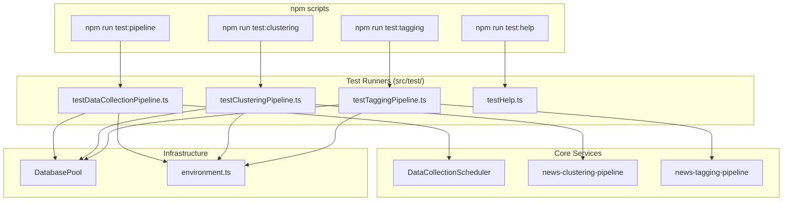

# Design Document

## Overview

이 설계는 개발자가 npm 스크립트를 통해 다양한 파이프라인을 쉽게 테스트할 수 있는 명령어 시스템을 구현합니다. 기존 `src/test/testDataCollectionPipeline.ts` 파일을 활용하고, 새로운 테스트 러너 파일들을 추가하여 `npm run test:*` 형태의 명령어를 제공합니다.

## Architecture



## Components and Interfaces

### 1. Test Runner Files

#### testDataCollectionPipeline.ts (기존 파일)
- 이미 구현된 테스트 함수들 활용
- 모드: `all`, `schedule`, `naver`, `aa`
- `process.argv[2]`로 모드 선택

#### testClusteringPipeline.ts (신규)
```typescript
interface ClusteringTestResult {
  status: 'success' | 'failure';
  duration: number;
  issueIndex?: number;
  error?: string;
}
```

#### testTaggingPipeline.ts (신규)
```typescript
interface TaggingTestResult {
  status: 'success' | 'failure';
  duration: number;
  articlesProcessed?: number;
  tagsMapped?: number;
  error?: string;
}
```

#### testHelp.ts (신규)
- 사용 가능한 테스트 명령어 목록 출력
- 각 명령어의 설명과 사용법 제공

### 2. npm Scripts (package.json)

```json
{
  "scripts": {
    "test:pipeline": "ts-node -r tsconfig-paths/register src/test/testDataCollectionPipeline.ts",
    "test:clustering": "ts-node -r tsconfig-paths/register src/test/testClusteringPipeline.ts",
    "test:tagging": "ts-node -r tsconfig-paths/register src/test/testTaggingPipeline.ts",
    "test:help": "ts-node -r tsconfig-paths/register src/test/testHelp.ts"
  }
}
```

### 3. Database Connection Pattern

모든 테스트 러너는 동일한 패턴을 따릅니다:

```typescript
async function runTest() {
  const dbPool = getDatabasePool();
  try {
    await dbPool.initialize();
    // 테스트 실행
  } catch (error) {
    console.error('테스트 실패:', error);
    process.exit(1);
  } finally {
    await dbPool.close();
  }
}
```

## Data Models

### TestResult (공통 인터페이스)

```typescript
interface TestResult {
  status: 'success' | 'failure';
  message: string;
  executedAt: string;
  duration: number;
  error?: string;
}
```

### TestCommand

```typescript
interface TestCommand {
  name: string;
  script: string;
  description: string;
  modes?: string[];
}
```

## Correctness Properties

*A property is a characteristic or behavior that should hold true across all valid executions of a system-essentially, a formal statement about what the system should do. Properties serve as the bridge between human-readable specifications and machine-verifiable correctness guarantees.*


Based on the prework analysis, the following properties are testable:

### Property 1: Mode argument parsing
*For any* valid mode argument (all, schedule, naver, aa), the test runner SHALL correctly parse the argument and execute the corresponding test function.
**Validates: Requirements 1.2, 1.3, 1.4**

### Property 2: Successful result output contains required information
*For any* successful pipeline test result, the output SHALL contain the execution duration in the formatted output.
**Validates: Requirements 2.2, 3.2**

### Property 3: Invalid mode produces helpful error
*For any* invalid mode argument, the test runner SHALL display an error message listing valid modes.
**Validates: Requirements 4.2**

### Property 4: Error exit code
*For any* test execution that encounters an error, the process SHALL exit with a non-zero exit code.
**Validates: Requirements 5.3**

## Error Handling

### Database Connection Errors
- `DatabaseException` 발생 시 에러 메시지 출력 후 `process.exit(1)`
- 에러 메시지에 연결 실패 원인 포함

### Environment Variable Errors
- `loadConfig()` 호출 시 필수 환경 변수 검증
- 누락된 변수 목록을 에러 메시지에 포함
- 예: `필수 환경 변수 누락: DB_HOST, DB_PASSWORD`

### Pipeline Execution Errors
- try-catch로 모든 파이프라인 에러 캐치
- 에러 스택 트레이스 출력
- `process.exit(1)`로 비정상 종료

## Testing Strategy

### Unit Testing
- 모드 파싱 로직 테스트
- 출력 포맷팅 함수 테스트
- 에러 핸들링 테스트

### Property-Based Testing
- Jest를 사용한 테스트 프레임워크
- fast-check 라이브러리를 사용한 property-based testing
- 각 property test는 최소 100회 반복 실행

### Integration Testing (수동)
- 실제 DB 연결 테스트
- 파이프라인 end-to-end 테스트
